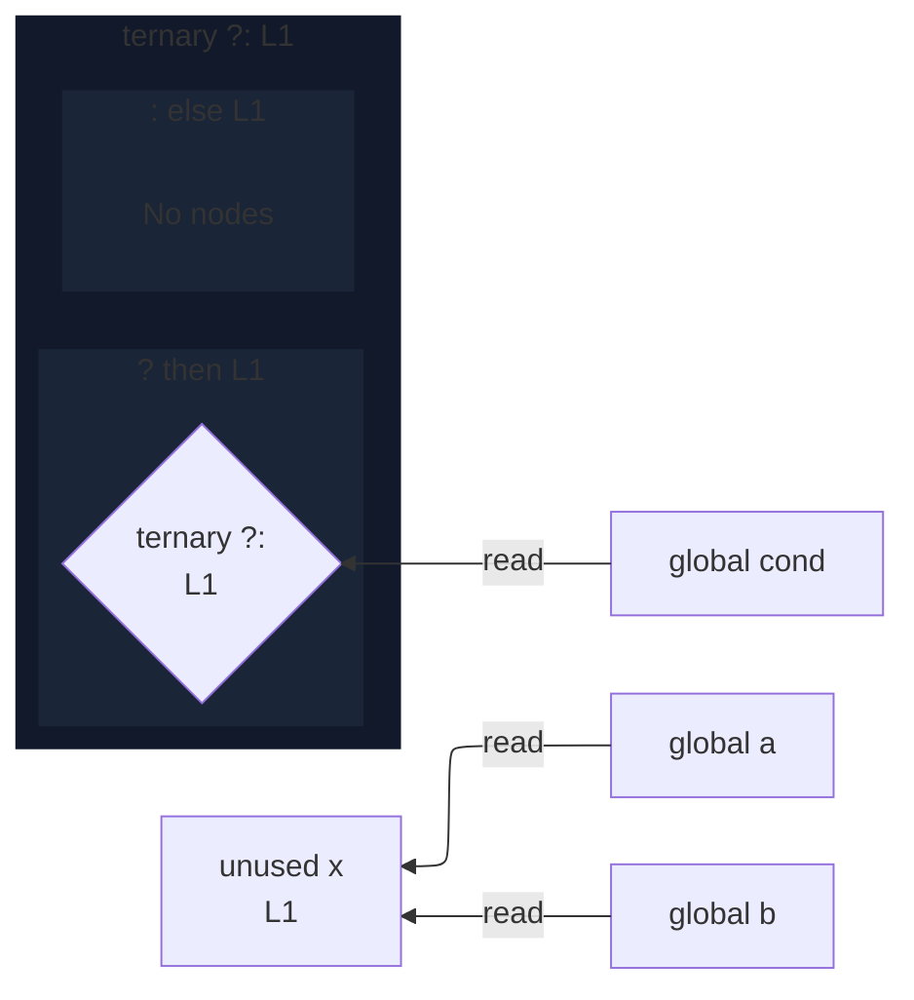

# integration/fixtures/app-behavior/ast-type-coverage/conditional-expression/input.ts

## Input

```ts
const x = cond ? a : b;
```

## Mermaid


```mermaid
%%{init: {"flowchart": {"defaultRenderer": "elk"}}}%%
flowchart RL
  n_scope_0_x_6["unused x<br/>L1"]
  n_scope_0_cond_10["global cond"]
  n_scope_0_a_17["global a"]
  n_scope_0_b_21["global b"]
  subgraph cont_ternary_scope_0_10["ternary ?: L1"]
    direction RL
    subgraph s_scope_1["? then L1"]
      direction RL
      ternary_test_scope_0_10{"ternary ?:<br/>L1"}
    end
    subgraph s_scope_2[": else L1"]
      direction RL
      elk_empty_s_scope_2["No nodes"]
    end
  end
  n_scope_0_cond_10 -->|read| ternary_test_scope_0_10
  n_scope_0_a_17 -->|read| n_scope_0_x_6
  n_scope_0_b_21 -->|read| n_scope_0_x_6
  classDef nestL1 fill:#11192a,stroke:transparent;
  class cont_ternary_scope_0_10 nestL1;
  classDef nestL2 fill:#1a2538,stroke:transparent;
  class s_scope_1 nestL2;
  class s_scope_2 nestL2;
  classDef elkEmptyPlaceholder fill:transparent,stroke:transparent;
  class elk_empty_s_scope_2 elkEmptyPlaceholder;
```
