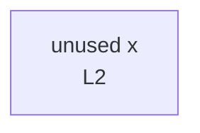

# integration/fixtures/app-behavior/ast-type-coverage/hashbang/input.ts

## Input

```ts
#!/usr/bin/env node
const x = 1;
```

## Mermaid


```mermaid
%%{init: {"flowchart": {"defaultRenderer": "elk"}}}%%
flowchart RL
  n_scope_0_x_26["unused x<br/>L2"]
```
