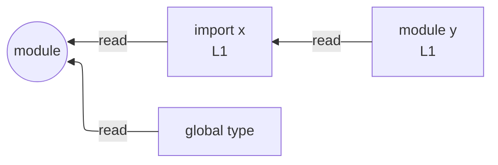

# integration/fixtures/app-behavior/ast-type-coverage/import-attribute/input.ts

## Input

```ts
import x from "y" with { type: "json" };

export { x };
```

## Mermaid


```mermaid
%%{init: {"flowchart": {"defaultRenderer": "elk"}}}%%
flowchart RL
  n_scope_0_x_7["import x<br/>L1"]
  n_scope_0_type_25["global type"]
  n_scope_0_type_25 -->|read| module_root
  n_scope_0_x_7 -->|read| module_root
  module_root((module))
  mod_y["module y<br/>L1"]
  mod_y -->|read| n_scope_0_x_7
```
