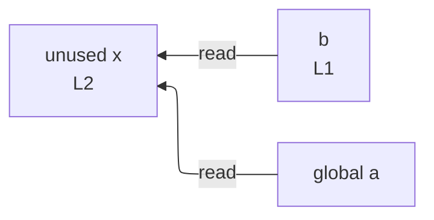

# integration/fixtures/app-behavior/ast-type-coverage/jsx-expression-container/input.tsx

## Input

```tsx
const b = 1;
const x = (<a>{b}</a>);
```

## Mermaid


```mermaid
%%{init: {"flowchart": {"defaultRenderer": "elk"}}}%%
flowchart RL
  n_scope_0_b_6["b<br/>L1"]
  n_scope_0_x_19["unused x<br/>L2"]
  n_scope_0_a_25["global a"]
  n_scope_0_a_25 -->|read| n_scope_0_x_19
  n_scope_0_b_6 -->|read| n_scope_0_x_19
```
