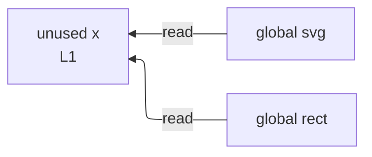

# integration/fixtures/app-behavior/ast-type-coverage/jsx-namespaced-name/input.tsx

## Input

```tsx
const x = (<svg:rect />);
```

## Mermaid


```mermaid
%%{init: {"flowchart": {"defaultRenderer": "elk"}}}%%
flowchart RL
  n_scope_0_x_6["unused x<br/>L1"]
  n_scope_0_svg_12["global svg"]
  n_scope_0_rect_16["global rect"]
  n_scope_0_svg_12 -->|read| n_scope_0_x_6
  n_scope_0_rect_16 -->|read| n_scope_0_x_6
```
