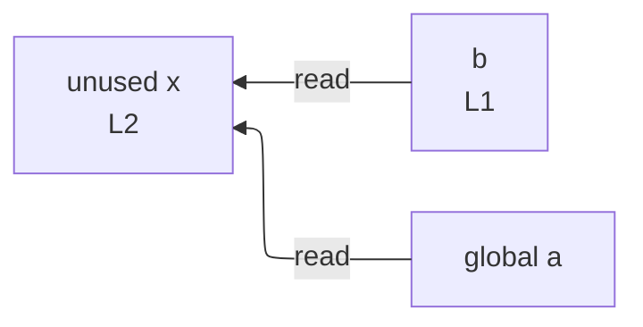

# integration/fixtures/app-behavior/ast-type-coverage/jsx-spread-attribute/input.tsx

## Input

```tsx
const b = { a: 1 };
const x = (<a {...b} />);
```

## Mermaid


```mermaid
%%{init: {"flowchart": {"defaultRenderer": "elk"}}}%%
flowchart RL
  n_scope_0_b_6["b<br/>L1"]
  n_scope_0_x_26["unused x<br/>L2"]
  n_scope_0_a_32["global a"]
  n_scope_0_a_32 -->|read| n_scope_0_x_26
  n_scope_0_b_6 -->|read| n_scope_0_x_26
```
