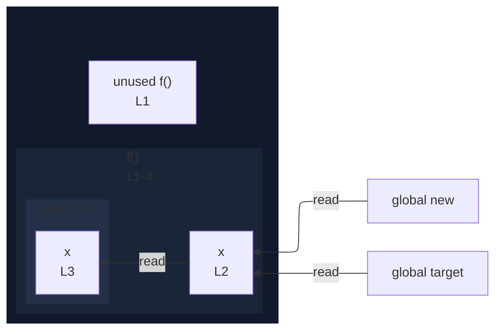

# integration/fixtures/app-behavior/ast-type-coverage/meta-property/input.ts

## Input

```ts
function f() {
  const x = new.target;
  return x;
}
```

## Mermaid


```mermaid
%%{init: {"flowchart": {"defaultRenderer": "elk"}}}%%
flowchart RL
  n_scope_0_new_27["global new"]
  n_scope_0_target_31["global target"]
  subgraph wrap_s_scope_1[" "]
    direction TB
    n_scope_0_f_9["unused f()<br/>L1"]
    subgraph s_scope_1["f()<br/>L1-4"]
      direction RL
      n_scope_1_x_23["x<br/>L2"]
      subgraph s_return_scope_0_f_9_41_50["return L3"]
        direction RL
        ret_use_ref_3["x<br/>L3"]
      end
    end
  end
  n_scope_0_new_27 -->|read| n_scope_1_x_23
  n_scope_0_target_31 -->|read| n_scope_1_x_23
  n_scope_1_x_23 -->|read| ret_use_ref_3
  classDef nestL1 fill:#11192a,stroke:transparent;
  class wrap_s_scope_1 nestL1;
  classDef nestL2 fill:#1a2538,stroke:transparent;
  class s_scope_1 nestL2;
  classDef nestL3 fill:#243047,stroke:transparent;
  class s_return_scope_0_f_9_41_50 nestL3;
```
