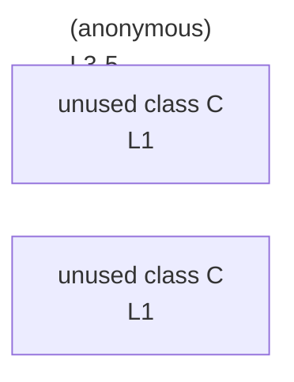

# integration/fixtures/app-behavior/ast-type-coverage/private-identifier/input.ts

## Input

```ts
class C {
  #x = 1;
  get x() {
    return this.#x;
  }
}
```

## Mermaid


```mermaid
%%{init: {"flowchart": {"defaultRenderer": "elk"}}}%%
flowchart RL
  n_scope_0_C_6["unused class C<br/>L1"]
  n_scope_1_C_6["unused class C<br/>L1"]
  subgraph s_scope_2["(anonymous)<br/>L3-5"]
    direction RL
  end
  classDef nestL1 fill:#11192a,stroke:transparent;
  class s_scope_2 nestL1;
```
