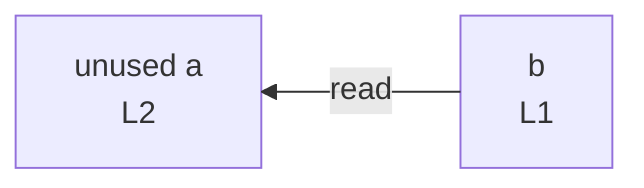

# integration/fixtures/app-behavior/ast-type-coverage/spread-element/input.ts

## Input

```ts
const b = [1, 2];
const a = [...b];
```

## Mermaid


```mermaid
%%{init: {"flowchart": {"defaultRenderer": "elk"}}}%%
flowchart RL
  n_scope_0_b_6["b<br/>L1"]
  n_scope_0_a_24["unused a<br/>L2"]
  n_scope_0_b_6 -->|read| n_scope_0_a_24
```
