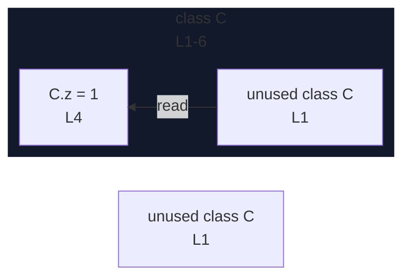

# integration/fixtures/app-behavior/ast-type-coverage/static-block/input.ts

## Input

```ts
class C {
  static z = 0;
  static {
    C.z = 1;
  }
}
```

## Mermaid


```mermaid
%%{init: {"flowchart": {"defaultRenderer": "elk"}}}%%
flowchart RL
  n_scope_0_C_6["unused class C<br/>L1"]
  subgraph s_scope_1["class C<br/>L1-6"]
    direction RL
    n_scope_1_C_6["unused class C<br/>L1"]
    expr_stmt_41["C.z = 1<br/>L4"]
  end
  n_scope_1_C_6 -->|read| expr_stmt_41
  classDef nestL1 fill:#11192a,stroke:transparent;
  class s_scope_1 nestL1;
```
