# integration/fixtures/app-behavior/ast-type-coverage/super/input.ts

## Input

```ts
class D {
  m() {
    return 1;
  }
}
class C extends D {
  m() {
    return super.m();
  }
}
```

## Mermaid

```mermaid
%%{init: {"flowchart": {"defaultRenderer": "elk"}}}%%
flowchart RL
  n_scope_0_D_6["class D<br/>L1"]
  n_scope_0_C_44["unused class C<br/>L6"]
  subgraph s_scope_1["class D<br/>L1-5"]
    direction RL
    n_scope_1_D_6["unused class D<br/>L1"]
    subgraph s_scope_2["(anonymous)<br/>L2-4"]
      direction RL
    end
  end
  subgraph s_scope_3["class C<br/>L6-10"]
    direction RL
    n_scope_3_C_44["unused class C<br/>L6"]
    subgraph s_scope_4["(anonymous)<br/>L7-9"]
      direction RL
    end
  end
  n_scope_0_D_6 -->|read| module_root
  module_root((module))
  classDef nestL1 fill:#11192a,stroke:transparent;
  class s_scope_1 nestL1;
  class s_scope_3 nestL1;
  classDef nestL2 fill:#1a2538,stroke:transparent;
  class s_scope_2 nestL2;
  class s_scope_4 nestL2;
```


