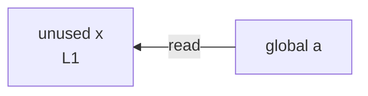

# integration/fixtures/app-behavior/ast-type-coverage/tagged-template-expression/input.ts

## Input

```ts
const x = a`b`;
```

## Mermaid


```mermaid
%%{init: {"flowchart": {"defaultRenderer": "elk"}}}%%
flowchart RL
  n_scope_0_x_6["unused x<br/>L1"]
  n_scope_0_a_10["global a"]
  n_scope_0_a_10 -->|read| n_scope_0_x_6
```
