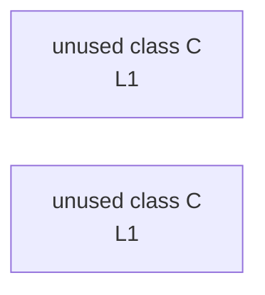

# integration/fixtures/app-behavior/ast-type-coverage/ts-abstract-property-definition/input.ts

## Input

```ts
abstract class C {
  abstract x: string;
}
```

## Mermaid


```mermaid
%%{init: {"flowchart": {"defaultRenderer": "elk"}}}%%
flowchart RL
  n_scope_0_C_15["unused class C<br/>L1"]
  n_scope_1_C_15["unused class C<br/>L1"]
```
