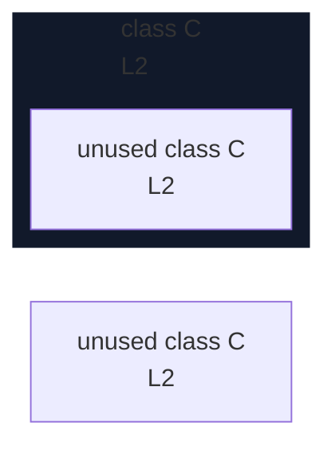

# integration/fixtures/app-behavior/ast-type-coverage/ts-class-implements/input.ts

## Input

```ts
interface I {}
class C implements I {}
```

## Mermaid


```mermaid
%%{init: {"flowchart": {"defaultRenderer": "elk"}}}%%
flowchart RL
  n_scope_0_C_21["unused class C<br/>L2"]
  subgraph s_scope_1["class C<br/>L2"]
    direction RL
    n_scope_1_C_21["unused class C<br/>L2"]
  end
  classDef nestL1 fill:#11192a,stroke:transparent;
  class s_scope_1 nestL1;
```
