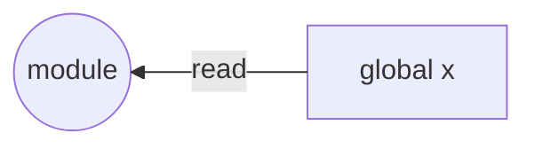

# integration/fixtures/app-behavior/ast-type-coverage/ts-import-equals/input.ts

## Input

```ts
import x = require("y");
export { x };
```

## Mermaid


```mermaid
%%{init: {"flowchart": {"defaultRenderer": "elk"}}}%%
flowchart RL
  n_scope_0_x_34["global x"]
  n_scope_0_x_34 -->|read| module_root
  module_root((module))
```
