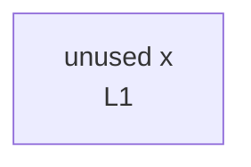

# integration/fixtures/app-behavior/ast-type-coverage/ts-null-keyword/input.ts

## Input

```ts
const x: null = null;
```

## Mermaid


```mermaid
%%{init: {"flowchart": {"defaultRenderer": "elk"}}}%%
flowchart RL
  n_scope_0_x_6["unused x<br/>L1"]
```
