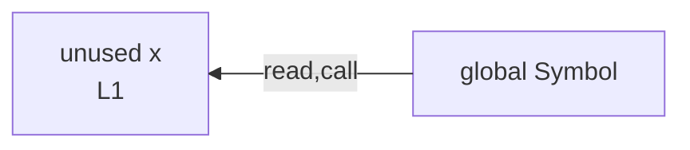

# integration/fixtures/app-behavior/ast-type-coverage/ts-symbol-keyword/input.ts

## Input

```ts
const x: symbol = Symbol();
```

## Mermaid


```mermaid
%%{init: {"flowchart": {"defaultRenderer": "elk"}}}%%
flowchart RL
  n_scope_0_x_6["unused x<br/>L1"]
  n_scope_0_Symbol_18["global Symbol"]
  n_scope_0_Symbol_18 -->|read,call| n_scope_0_x_6
```
