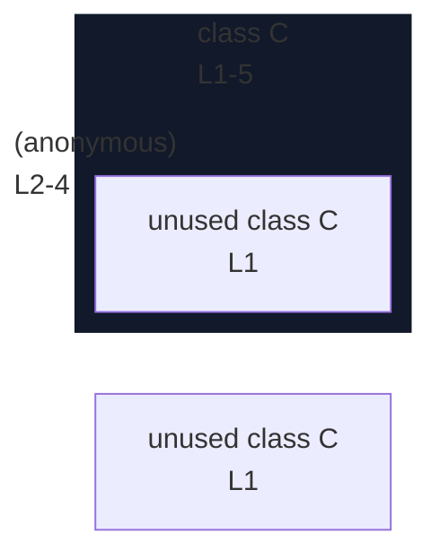

# integration/fixtures/app-behavior/ast-type-coverage/ts-this-type/input.ts

## Input

```ts
class C {
  m(): this {
    return this;
  }
}
```

## Mermaid


```mermaid
%%{init: {"flowchart": {"defaultRenderer": "elk"}}}%%
flowchart RL
  n_scope_0_C_6["unused class C<br/>L1"]
  subgraph s_scope_1["class C<br/>L1-5"]
    direction RL
    n_scope_1_C_6["unused class C<br/>L1"]
    subgraph s_scope_2["(anonymous)<br/>L2-4"]
      direction RL
    end
  end
  classDef nestL1 fill:#11192a,stroke:transparent;
  class s_scope_1 nestL1;
  classDef nestL2 fill:#1a2538,stroke:transparent;
  class s_scope_2 nestL2;
```
