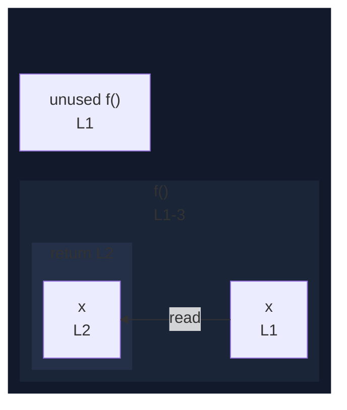

# integration/fixtures/app-behavior/ast-type-coverage/ts-type-parameter/input.ts

## Input

```ts
function f<T>(x: T): T {
  return x;
}
```

## Mermaid


```mermaid
%%{init: {"flowchart": {"defaultRenderer": "elk"}}}%%
flowchart RL
  subgraph wrap_s_scope_1[" "]
    direction TB
    n_scope_0_f_9["unused f()<br/>L1"]
    subgraph s_scope_1["f()<br/>L1-3"]
      direction RL
      n_scope_1_x_14["x<br/>L1"]
      subgraph s_return_scope_0_f_9_27_36["return L2"]
        direction RL
        ret_use_ref_0["x<br/>L2"]
      end
    end
  end
  n_scope_1_x_14 -->|read| ret_use_ref_0
  classDef nestL1 fill:#11192a,stroke:transparent;
  class wrap_s_scope_1 nestL1;
  classDef nestL2 fill:#1a2538,stroke:transparent;
  class s_scope_1 nestL2;
  classDef nestL3 fill:#243047,stroke:transparent;
  class s_return_scope_0_f_9_27_36 nestL3;
```
