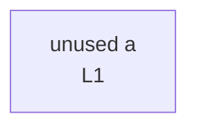

# integration/fixtures/app-behavior/ast-type-coverage/ts-type-query/input.ts

## Input

```ts
const a = 1;
type T = typeof a;
```

## Mermaid


```mermaid
%%{init: {"flowchart": {"defaultRenderer": "elk"}}}%%
flowchart RL
  n_scope_0_a_6["unused a<br/>L1"]
```
