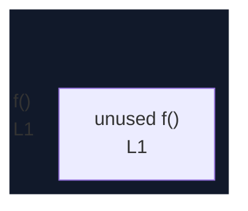

# integration/fixtures/app-behavior/ast-type-coverage/ts-void-keyword/input.ts

## Input

```ts
function f(): void {}
```

## Mermaid


```mermaid
%%{init: {"flowchart": {"defaultRenderer": "elk"}}}%%
flowchart RL
  subgraph wrap_s_scope_1[" "]
    direction TB
    n_scope_0_f_9["unused f()<br/>L1"]
    subgraph s_scope_1["f()<br/>L1"]
      direction RL
    end
  end
  classDef nestL1 fill:#11192a,stroke:transparent;
  class wrap_s_scope_1 nestL1;
  classDef nestL2 fill:#1a2538,stroke:transparent;
  class s_scope_1 nestL2;
```
