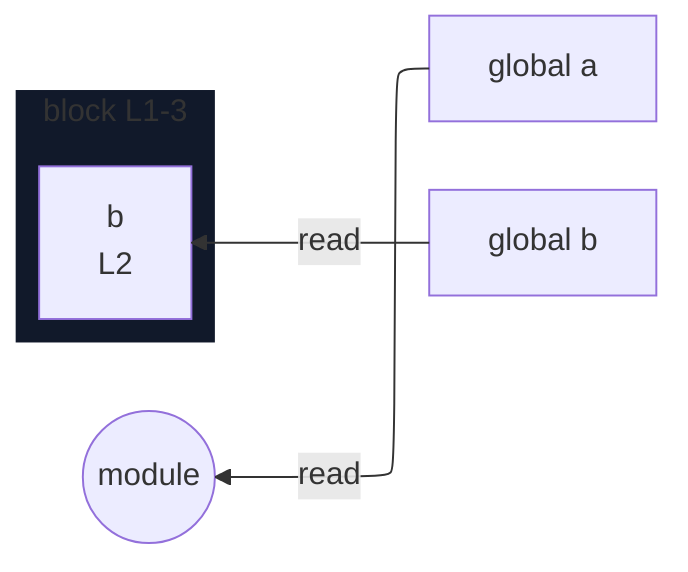

# integration/fixtures/app-behavior/ast-type-coverage/with-statement/input.ts

## Input

```ts
with (a) {
  b;
}
```

## Mermaid


```mermaid
%%{init: {"flowchart": {"defaultRenderer": "elk"}}}%%
flowchart RL
  n_scope_0_a_6["global a"]
  n_scope_0_b_13["global b"]
  subgraph s_scope_1["block L1-3"]
    direction RL
    expr_stmt_13["b<br/>L2"]
  end
  n_scope_0_a_6 -->|read| module_root
  n_scope_0_b_13 -->|read| expr_stmt_13
  module_root((module))
  classDef nestL1 fill:#11192a,stroke:transparent;
  class s_scope_1 nestL1;
```
