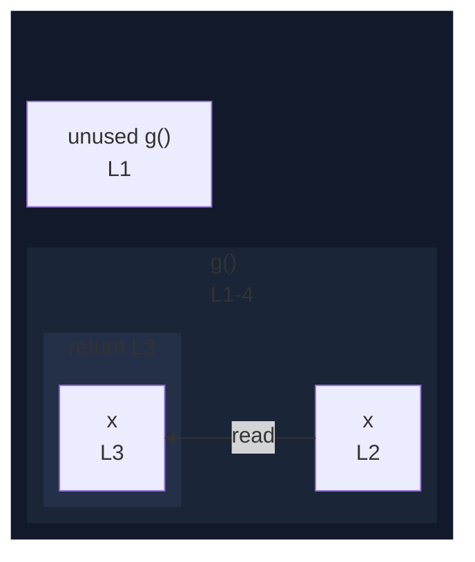

# integration/fixtures/app-behavior/ast-type-coverage/yield-expression/input.ts

## Input

```ts
function* g() {
  const x = yield 1;
  return x;
}
```

## Mermaid


```mermaid
%%{init: {"flowchart": {"defaultRenderer": "elk"}}}%%
flowchart RL
  subgraph wrap_s_scope_1[" "]
    direction TB
    n_scope_0_g_10["unused g()<br/>L1"]
    subgraph s_scope_1["g()<br/>L1-4"]
      direction RL
      n_scope_1_x_24["x<br/>L2"]
      subgraph s_return_scope_0_g_10_39_48["return L3"]
        direction RL
        ret_use_ref_1["x<br/>L3"]
      end
    end
  end
  n_scope_1_x_24 -->|read| ret_use_ref_1
  classDef nestL1 fill:#11192a,stroke:transparent;
  class wrap_s_scope_1 nestL1;
  classDef nestL2 fill:#1a2538,stroke:transparent;
  class s_scope_1 nestL2;
  classDef nestL3 fill:#243047,stroke:transparent;
  class s_return_scope_0_g_10_39_48 nestL3;
```
