# integration/fixtures/app-behavior/depth/block/input.ts

## Input

```ts
{
  const v1 = 1;
  {
    const v2 = v1;
    {
      const v3 = v2;
      {
        const v4 = v3;
        {
          const v5 = v4;
          {
            const v6 = v5;
            console.log(v1, v2, v3, v4, v5, v6);
          }
        }
      }
    }
  }
}
```

## Query

```sh
--depth 2
```

## Mermaid

```mermaid
%%{init: {"flowchart": {"defaultRenderer": "elk"}}}%%
flowchart RL
  n_scope_0_console_185["global console"]
  subgraph s_scope_1["block L1-19"]
    direction RL
    n_scope_1_v1_10["v1<br/>L2"]
    subgraph s_scope_2["block L3-18"]
      direction RL
      n_scope_2_v2_32["v2<br/>L4"]
      beyond_depth_s_scope_2((...))
    end
  end
  n_scope_1_v1_10 -->|read| n_scope_2_v2_32
  n_scope_2_v2_32 -.->|read| beyond_depth_s_scope_2
  n_scope_0_console_185 -.->|read| beyond_depth_s_scope_2
  n_scope_1_v1_10 -.->|read| beyond_depth_s_scope_2
  classDef boundaryStub fill:transparent,stroke:#888,stroke-dasharray:3 3,color:#888;
  class beyond_depth_s_scope_2 boundaryStub;
  classDef nestL1 fill:#1e2738,stroke:#3d4a63;
  class s_scope_1 nestL1;
  classDef nestL2 fill:#233045,stroke:#475670;
  class s_scope_2 nestL2;
```


