# integration/fixtures/app-behavior/depth/for/input.ts

## Input

```ts
for (let i1 = 0; i1 < 1; i1++) {
  for (let i2 = 0; i2 < 1; i2++) {
    for (let i3 = 0; i3 < 1; i3++) {
      for (let i4 = 0; i4 < 1; i4++) {
        for (let i5 = 0; i5 < 1; i5++) {
          for (let i6 = 0; i6 < 1; i6++) {
            console.log(i1, i2, i3, i4, i5, i6);
          }
        }
      }
    }
  }
}
```

## Query

```sh
--depth 5
```

## Mermaid

```mermaid
%%{init: {"flowchart": {"defaultRenderer": "elk"}}}%%
flowchart RL
  n_scope_0_console_240["global console"]
  subgraph s_scope_1["for L1-13"]
    direction RL
    for_test_scope_0_0["for ()<br/>L1"]
    n_scope_1_i1_9["let i1<br/>L1"]
    wr_ref_2(["let i1<br/>L1"])
    subgraph s_scope_2["block L1-13"]
      direction RL
      subgraph s_scope_3["for L2-12"]
        direction RL
        for_test_scope_2_35["for ()<br/>L2"]
        n_scope_3_i2_44["let i2<br/>L2"]
        wr_ref_5(["let i2<br/>L2"])
        subgraph s_scope_4["block L2-12"]
          direction RL
          subgraph s_scope_5["for L3-11"]
            direction RL
            for_test_scope_4_72["for ()<br/>L3"]
            n_scope_5_i3_81["let i3<br/>L3"]
            wr_ref_8(["let i3<br/>L3"])
            subgraph s_scope_6["block L3-11"]
              direction RL
              subgraph s_scope_7["for L4-10"]
                direction RL
                for_test_scope_6_111["for ()<br/>L4"]
                n_scope_7_i4_120["let i4<br/>L4"]
                wr_ref_11(["let i4<br/>L4"])
                subgraph s_scope_8["block L4-10"]
                  direction RL
                  subgraph s_scope_9["for L5-9"]
                    direction RL
                    for_test_scope_8_152["for ()<br/>L5"]
                    n_scope_9_i5_161["let i5<br/>L5"]
                    wr_ref_14(["let i5<br/>L5"])
                    subgraph s_scope_10["block L5-9"]
                      direction RL
                      subgraph s_scope_11["for L6-8"]
                        direction RL
                        for_test_scope_10_195["for ()<br/>L6"]
                        n_scope_11_i6_204["let i6<br/>L6"]
                        wr_ref_17(["let i6<br/>L6"])
                        beyond_depth_s_scope_11((...))
                      end
                    end
                  end
                end
              end
            end
          end
        end
      end
    end
  end
  n_scope_1_i1_9 -->|set| wr_ref_2
  n_scope_3_i2_44 -->|set| wr_ref_5
  n_scope_5_i3_81 -->|set| wr_ref_8
  n_scope_7_i4_120 -->|set| wr_ref_11
  n_scope_9_i5_161 -->|set| wr_ref_14
  n_scope_11_i6_204 -->|set| wr_ref_17
  n_scope_1_i1_9 -->|read| for_test_scope_0_0
  n_scope_3_i2_44 -->|read| for_test_scope_2_35
  n_scope_5_i3_81 -->|read| for_test_scope_4_72
  n_scope_7_i4_120 -->|read| for_test_scope_6_111
  n_scope_9_i5_161 -->|read| for_test_scope_8_152
  n_scope_11_i6_204 -->|read| for_test_scope_10_195
  n_scope_0_console_240 -.->|read| beyond_depth_s_scope_11
  wr_ref_2 -.->|read| beyond_depth_s_scope_11
  wr_ref_5 -.->|read| beyond_depth_s_scope_11
  wr_ref_8 -.->|read| beyond_depth_s_scope_11
  wr_ref_11 -.->|read| beyond_depth_s_scope_11
  wr_ref_14 -.->|read| beyond_depth_s_scope_11
  wr_ref_17 -.->|read| beyond_depth_s_scope_11
  classDef boundaryStub fill:transparent,stroke:#888,stroke-dasharray:3 3,color:#888;
  class beyond_depth_s_scope_11 boundaryStub;
```


