# integration/fixtures/app-behavior/depth/function-and-block/input.ts

## Input

```ts
const a = true;
const b = true;
const c = true;

function f1() {
  if (a) {
    if (b) {
      function f2() {
        if (c) {
          const x = 1;
          console.log(x);
        }
      }
      f2();
    }
  }
}

f1();
```

## Mermaid

```mermaid
%%{init: {"flowchart": {"defaultRenderer": "elk"}}}%%
flowchart RL
  n_scope_0_a_6["a<br/>L1"]
  n_scope_0_b_22["b<br/>L2"]
  n_scope_0_c_38["c<br/>L3"]
  n_scope_0_console_161["global console"]
  subgraph wrap_s_scope_1[" "]
    direction TB
    n_scope_0_f1_58["f1()<br/>L5"]
    subgraph s_scope_1["f1()<br/>L5-17"]
      direction RL
      subgraph s_scope_2["if L6-16"]
        direction RL
        if_test_scope_1_67{"if ()<br/>L6"}
        beyond_depth_s_scope_2((...))
      end
    end
  end
  n_scope_0_a_6 -->|read| if_test_scope_1_67
  n_scope_0_b_22 -.->|read| beyond_depth_s_scope_2
  n_scope_0_c_38 -.->|read| beyond_depth_s_scope_2
  n_scope_0_console_161 -.->|read| beyond_depth_s_scope_2
  n_scope_0_f1_58 -->|read,call| expr_stmt_220
  expr_stmt_220["f1()<br/>L19"]
  classDef fnWrap fill:#1a2030,stroke:#5a7d99;
  class wrap_s_scope_1 fnWrap;
  classDef boundaryStub fill:transparent,stroke:#888,stroke-dasharray:3 3,color:#888;
  class beyond_depth_s_scope_2 boundaryStub;
```


