# integration/fixtures/app-behavior/depth/function/input.ts

## Input

```ts
function f1() {
  function f2() {
    function f3() {
      function f4() {
        function f5() {
          function f6() {
            const x = 1;
            return x;
          }
          return f6();
        }
        return f5();
      }
      return f4();
    }
    return f3();
  }
  return f2();
}

f1();
```

## Mermaid

```mermaid
%%{init: {"flowchart": {"defaultRenderer": "elk"}}}%%
flowchart RL
  subgraph wrap_s_scope_1[" "]
    direction TB
    n_scope_0_f1_9["f1()<br/>L1"]
    subgraph s_scope_1["f1()<br/>L1-19"]
      direction RL
      subgraph wrap_s_scope_2[" "]
        direction TB
        n_scope_1_f2_27["f2()<br/>L2"]
        subgraph s_scope_2["f2()<br/>L2-17"]
          direction RL
          n_scope_2_f3_47["f3()<br/>L3"]
          subgraph s_return_scope_1_f2_27_276_288["return L16"]
            direction RL
            ret_use_ref_5["f3<br/>L16"]
          end
        end
      end
      subgraph s_return_scope_0_f1_9_295_307["return L18"]
        direction RL
        ret_use_ref_6["f2<br/>L18"]
      end
    end
  end
  n_scope_2_f3_47 -->|read,call| ret_use_ref_5
  n_scope_1_f2_27 -->|read,call| ret_use_ref_6
  n_scope_0_f1_9 -->|read,call| expr_stmt_311
  expr_stmt_311["f1()<br/>L21"]
  classDef fnWrap fill:#1a2030,stroke:#5a7d99;
  class wrap_s_scope_1 fnWrap;
  class wrap_s_scope_2 fnWrap;
```


