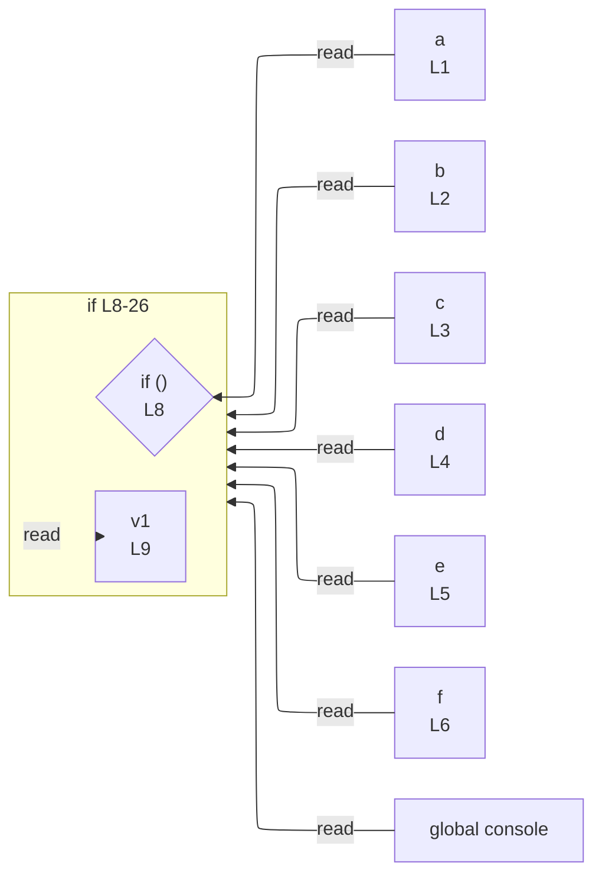

# integration/fixtures/app-behavior/depth/if/input.ts

## Input

```ts
const a = true;
const b = true;
const c = true;
const d = true;
const e = true;
const f = true;

if (a) {
  const v1 = 1;
  if (b) {
    const v2 = v1;
    if (c) {
      const v3 = v2;
      if (d) {
        const v4 = v3;
        if (e) {
          const v5 = v4;
          if (f) {
            const v6 = v5;
            console.log(v6);
          }
        }
      }
    }
  }
}
```

## Mermaid


