# integration/fixtures/app-behavior/depth/switch/input.ts

## Input

```ts
const x = 1;

switch (x) {
  case 1:
    switch (x) {
      case 1:
        switch (x) {
          case 1:
            switch (x) {
              case 1:
                switch (x) {
                  case 1:
                    switch (x) {
                      case 1:
                        console.log(x);
                        break;
                    }
                    break;
                }
                break;
            }
            break;
        }
        break;
    }
    break;
}
```

## Query

```sh
--depth 2
```

## Mermaid

```mermaid
%%{init: {"flowchart": {"defaultRenderer": "elk"}}}%%
flowchart RL
  n_scope_0_x_6["x<br/>L1"]
  n_scope_0_console_296["global console"]
  subgraph s_scope_1["switch L3-27"]
    direction RL
    switch_discriminant_scope_0_14{"switch ()<br/>L3"}
    subgraph s_scope_2["case 1 L4-26"]
      direction RL
      bc_break_501["break<br/>L26"]
      subgraph s_scope_3["switch L5-25"]
        direction RL
        switch_discriminant_scope_2_41{"switch ()<br/>L5"}
        subgraph s_scope_4["case 1 L6-24"]
          direction RL
          bc_break_484["break<br/>L24"]
          beyond_depth_s_scope_4((...))
        end
      end
    end
  end
  n_scope_0_x_6 -->|read| switch_discriminant_scope_0_14
  n_scope_0_x_6 -->|read| switch_discriminant_scope_2_41
  n_scope_0_x_6 -.->|read| beyond_depth_s_scope_4
  n_scope_0_console_296 -.->|read| beyond_depth_s_scope_4
  classDef boundaryStub stroke:#888,stroke-dasharray:3 3,color:#888;
  class beyond_depth_s_scope_4 boundaryStub;
  classDef nestL1 fill:#11192a,stroke:transparent;
  class s_scope_1 nestL1;
  classDef nestL2 fill:#1a2538,stroke:transparent;
  class s_scope_2 nestL2;
  classDef nestL3 fill:#243047,stroke:transparent;
  class s_scope_3 nestL3;
  classDef nestL4 fill:#2d3b57,stroke:transparent;
  class s_scope_4 nestL4;
```


