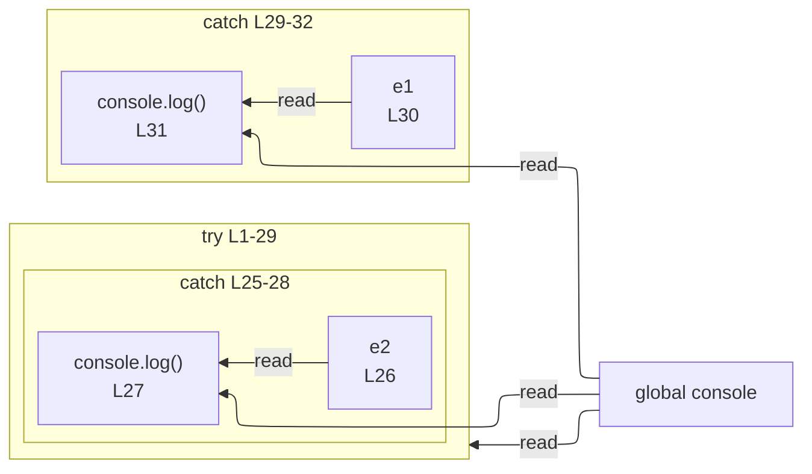

# integration/fixtures/app-behavior/depth/try-catch-finally/input.ts

## Input

```ts
try {
  try {
    try {
      try {
        try {
          try {
            const x = 1;
            console.log(x);
          } catch {
            const e6 = "e6";
            console.log(e6);
          }
        } catch {
          const e5 = "e5";
          console.log(e5);
        }
      } catch {
        const e4 = "e4";
        console.log(e4);
      }
    } catch {
      const e3 = "e3";
      console.log(e3);
    }
  } catch {
    const e2 = "e2";
    console.log(e2);
  }
} catch {
  const e1 = "e1";
  console.log(e1);
}
```

## Mermaid


