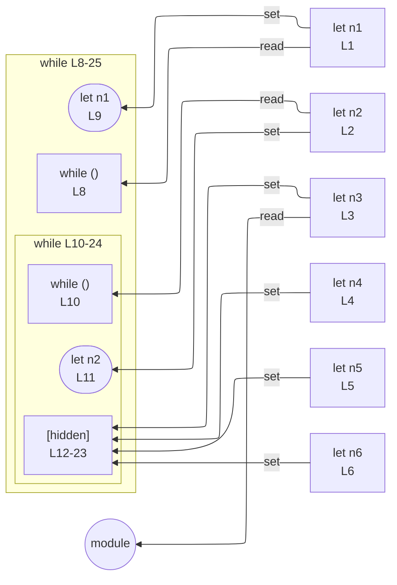

# integration/fixtures/app-behavior/depth/while/input.ts

## Input

```ts
let n1 = 1;
let n2 = 1;
let n3 = 1;
let n4 = 1;
let n5 = 1;
let n6 = 1;

while (n1 > 0) {
  n1--;
  while (n2 > 0) {
    n2--;
    while (n3 > 0) {
      n3--;
      while (n4 > 0) {
        n4--;
        while (n5 > 0) {
          n5--;
          while (n6 > 0) {
            n6--;
          }
        }
      }
    }
  }
}
```

## Mermaid


