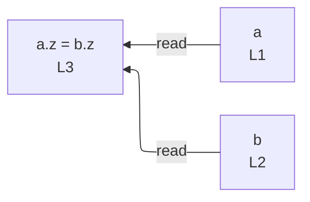

# integration/fixtures/app-behavior/expression-statement-head/member-assignment-both-sides/input.ts

## Input

```ts
const a = { z: 0 };
const b = { z: 1 };
a.z = b.z;
```

## Mermaid


```mermaid
%%{init: {"flowchart": {"defaultRenderer": "elk"}}}%%
flowchart RL
  n_scope_0_a_6["a<br/>L1"]
  n_scope_0_b_26["b<br/>L2"]
  n_scope_0_a_6 -->|read| expr_stmt_40
  n_scope_0_b_26 -->|read| expr_stmt_40
  expr_stmt_40["a.z = b.z<br/>L3"]
```
