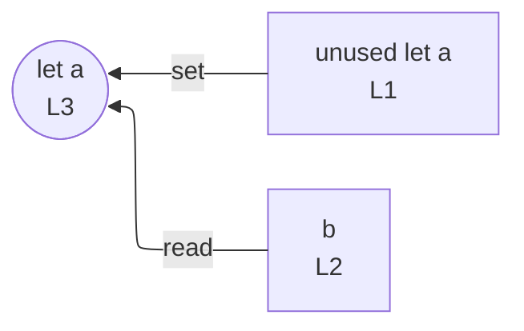

# integration/fixtures/app-behavior/expression-statement-head/variable-assignment-from-member/input.ts

## Input

```ts
let a;
const b = { z: 1 };
a = b.z;
```

## Mermaid


```mermaid
%%{init: {"flowchart": {"defaultRenderer": "elk"}}}%%
flowchart RL
  n_scope_0_a_4["unused let a<br/>L1"]
  n_scope_0_b_13["b<br/>L2"]
  wr_ref_1(["let a<br/>L3"])
  n_scope_0_a_4 -->|set| wr_ref_1
  n_scope_0_b_13 -->|read| wr_ref_1
```
