# integration/fixtures/app-behavior/highlight-shorthand/input.ts

## Input

```ts
function build() {
  const a = "a";
  const b = "b";
  return { a, b };
}
```

## Query

```sh
-H a
```

## Mermaid

```mermaid
%%{init: {"flowchart": {"defaultRenderer": "elk"}}}%%
flowchart RL
  subgraph wrap_s_scope_1[" "]
    direction TB
    n_scope_0_build_9["unused build()<br/>L1"]
    subgraph s_scope_1["build()<br/>L1-5"]
      direction RL
      n_scope_1_a_27["a<br/>L2"]
      n_scope_1_b_44["b<br/>L3"]
      subgraph s_return_scope_0_build_9_55_71["return L4"]
        direction RL
        ret_use_ref_2["a<br/>L4"]
        ret_use_ref_3["b<br/>L4"]
      end
    end
  end
  n_scope_1_a_27 -->|read| ret_use_ref_2
  n_scope_1_b_44 -->|read| ret_use_ref_3
  classDef nestL1 fill:#11192a,stroke:transparent;
  class wrap_s_scope_1 nestL1;
  classDef nestL2 fill:#1a2538,stroke:transparent;
  class s_scope_1 nestL2;
  classDef nestL3 fill:#243047,stroke:transparent;
  class s_return_scope_0_build_9_55_71 nestL3;
  style n_scope_1_a_27 fill:#facc15,stroke:#facc15,color:#0a0a0a;
  style ret_use_ref_2 fill:#facc15,stroke:#facc15,color:#0a0a0a;
  linkStyle 0 stroke:#facc15,stroke-width:2px;
```


