# integration/fixtures/app-behavior/plugin/react/use-callback/input.tsx

## Input

```tsx
import { useCallback } from "react";

const Counter = ({ start }: { start: number }) => {
  const inc = useCallback((n: number) => n + start, [start]);
  return <button>{inc(1)}</button>;
};
```

## Mermaid

```mermaid
%%{init: {"flowchart": {"defaultRenderer": "elk"}}}%%
flowchart RL
  n_scope_0_useCallback_9["import useCallback<br/>L1"]
  n_scope_0_button_162["global button"]
  subgraph wrap_s_scope_1[" "]
    direction TB
    n_scope_0_Counter_44["unused Counter()<br/>L3"]
    subgraph s_scope_1["Counter()<br/>L3-6"]
      direction RL
      n_scope_1_start_57["start<br/>L3"]
      n_scope_1_inc_98["inc<br/>L4"]
      subgraph s_scope_2["useCallback(args[0])<br/>L4"]
        direction RL
        n_scope_2_n_117["n<br/>L4"]
        subgraph s_return_scope_0_Counter_44_131_140["return L4"]
          direction RL
          ret_use_ref_3["n<br/>L4"]
          ret_use_ref_4["start<br/>L4"]
        end
      end
      subgraph s_return_scope_0_Counter_44_154_187["return L5"]
        direction RL
        ret_use_ref_6["&lt;button&gt;<br/>L5"]
        ret_use_ref_7["inc<br/>L5"]
      end
    end
  end
  n_scope_0_useCallback_9 -->|read,call| n_scope_1_inc_98
  n_scope_2_n_117 -->|read| ret_use_ref_3
  n_scope_1_start_57 -->|read| ret_use_ref_4
  n_scope_1_start_57 -->|read| n_scope_1_inc_98
  n_scope_0_button_162 -->|read| ret_use_ref_6
  n_scope_1_inc_98 -->|read,call| ret_use_ref_7
  s_scope_2 -->|useCallback| n_scope_1_inc_98
  mod_react["module react<br/>L1"]
  mod_react -->|read| n_scope_0_useCallback_9
  classDef nestL1 fill:#11192a,stroke:transparent;
  class wrap_s_scope_1 nestL1;
  classDef nestL2 fill:#1a2538,stroke:transparent;
  class s_scope_1 nestL2;
  classDef nestL3 fill:#243047,stroke:transparent;
  class s_scope_2 nestL3;
  class s_return_scope_0_Counter_44_154_187 nestL3;
  classDef nestL4 fill:#2d3b57,stroke:transparent;
  class s_return_scope_0_Counter_44_131_140 nestL4;
```


