# integration/fixtures/app-behavior/plugin/react/use-effect/input.tsx

## Input

```tsx
import { useEffect } from "react";

const Counter = ({ start, step }: { start: number; step: number }) => {
  useEffect(() => {
    const next = start + step;
    console.log(next);
  }, [start, step]);
  return <button>{start}</button>;
};
```

## Mermaid

```mermaid
%%{init: {"flowchart": {"defaultRenderer": "elk"}}}%%
flowchart RL
  n_scope_0_console_163["global console"]
  n_scope_0_button_213["global button"]
  subgraph wrap_s_scope_1[" "]
    direction TB
    n_scope_0_Counter_42["unused Counter()<br/>L3"]
    subgraph s_scope_1["Counter()<br/>L3-9"]
      direction RL
      n_scope_1_start_55["start<br/>L3"]
      n_scope_1_step_62["step<br/>L3"]
      subgraph expr_stmt_110["useEffect()<br/>L4-7"]
        direction RL
        subgraph s_scope_2["useEffect(args[0])<br/>L4-7"]
          direction RL
          n_scope_2_next_138["next<br/>L5"]
          expr_stmt_163["console.log()<br/>L6"]
        end
      end
      subgraph s_return_scope_0_Counter_42_205_237["return L8"]
        direction RL
        ret_use_ref_9["&lt;button&gt;<br/>L8"]
        ret_use_ref_10["start<br/>L8"]
      end
    end
  end
  subgraph sg_react["module react"]
    direction RL
    n_scope_0_useEffect_9["import useEffect<br/>L1"]
  end
  n_scope_0_useEffect_9 -->|read,call| expr_stmt_110
  n_scope_1_start_55 -->|read| n_scope_2_next_138
  n_scope_1_step_62 -->|read| n_scope_2_next_138
  n_scope_0_console_163 -->|read| expr_stmt_163
  n_scope_2_next_138 -->|read| expr_stmt_163
  n_scope_1_start_55 -->|read| expr_stmt_110
  n_scope_1_step_62 -->|read| expr_stmt_110
  n_scope_0_button_213 -->|read| ret_use_ref_9
  n_scope_1_start_55 -->|read| ret_use_ref_10
  classDef nestL1 fill:#11192a,stroke:transparent;
  class wrap_s_scope_1 nestL1;
  class sg_react nestL1;
  classDef nestL2 fill:#1a2538,stroke:transparent;
  class s_scope_1 nestL2;
  classDef nestL3 fill:#243047,stroke:transparent;
  class expr_stmt_110 nestL3;
  class s_return_scope_0_Counter_42_205_237 nestL3;
  classDef nestL4 fill:#2d3b57,stroke:transparent;
  class s_scope_2 nestL4;
  classDef edgeTargetSubgraph stroke:#888;
  class expr_stmt_110 edgeTargetSubgraph;
```


