# integration/fixtures/app-behavior/plugin/react/use-memo/input.tsx

## Input

```tsx
import { useMemo } from "react";

const Counter = ({ start }: { start: number }) => {
  const value = useMemo(() => {
    const doubled = start * 2;
    return doubled;
  }, [start]);
  return <button>{value}</button>;
};
```

## Mermaid

```mermaid
%%{init: {"flowchart": {"defaultRenderer": "elk"}}}%%
flowchart RL
  n_scope_0_button_194["global button"]
  subgraph wrap_s_scope_1[" "]
    direction TB
    n_scope_0_Counter_40["unused Counter()<br/>L3"]
    subgraph s_scope_1["Counter()<br/>L3-9"]
      direction RL
      n_scope_1_start_53["start<br/>L3"]
      n_scope_1_value_94["value<br/>L4"]
      subgraph s_scope_2["(anonymous)<br/>L4-7"]
        direction RL
        n_scope_2_doubled_128["doubled<br/>L5"]
        subgraph s_return_scope_0_Counter_40_153_168["return L6"]
          direction RL
          ret_use_ref_5["doubled<br/>L6"]
        end
      end
      subgraph s_return_scope_0_Counter_40_186_218["return L8"]
        direction RL
        ret_use_ref_7["&lt;button&gt;<br/>L8"]
        ret_use_ref_8["value<br/>L8"]
      end
    end
  end
  n_scope_1_start_53 -->|read| n_scope_2_doubled_128
  n_scope_2_doubled_128 -->|read| ret_use_ref_5
  n_scope_0_button_194 -->|read| ret_use_ref_7
  n_scope_1_value_94 -->|read| ret_use_ref_8
  classDef nestL1 fill:#11192a,stroke:transparent;
  class wrap_s_scope_1 nestL1;
  classDef nestL2 fill:#1a2538,stroke:transparent;
  class s_scope_1 nestL2;
  classDef nestL3 fill:#243047,stroke:transparent;
  class s_scope_2 nestL3;
  class s_return_scope_0_Counter_40_186_218 nestL3;
  classDef nestL4 fill:#2d3b57,stroke:transparent;
  class s_return_scope_0_Counter_40_153_168 nestL4;
```


