# integration/fixtures/app-behavior/pruning-and-depth/input.ts

## Input

```ts
const flag = true;

function inner() {
  if (flag) {
    if (flag) {
      const x = 1;
      console.log(x);
    }
  }
}

function callerOf() {
  inner();
}

function unrelated() {
  return 42;
}

callerOf();
unrelated();
```

## Query

```sh
-r inner -A 2 -B 1 --depth 1
```

## Mermaid

```mermaid
%%{init: {"flowchart": {"defaultRenderer": "elk"}}}%%
flowchart RL
  %% pruning roots inner=1 ancestors=1 descendants=2
  n_scope_0_inner_29["inner()<br/>L3"]
  subgraph s_scope_4["callerOf()<br/>L12-14"]
    direction RL
    expr_stmt_147["inner()<br/>L13"]
  end
  n_scope_0_inner_29 -->|read,call| expr_stmt_147
  classDef nestL1 fill:#11192a,stroke:transparent;
  class s_scope_4 nestL1;
```


