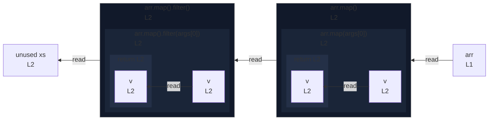

# integration/fixtures/callback/chained-methods/input.ts

## Input

```ts
const arr = [1, 2, 3];
const xs = arr.map((v) => v + 1).filter((v) => v > 0);
```

## Mermaid


```mermaid
%%{init: {"flowchart": {"defaultRenderer": "elk"}}}%%
flowchart RL
  n_scope_0_arr_6["arr<br/>L1"]
  n_scope_0_xs_29["unused xs<br/>L2"]
  subgraph call_proxy_34["arr.map().filter()<br/>L2"]
    direction RL
    subgraph s_scope_2["arr.map().filter(args[0])<br/>L2"]
      direction RL
      n_scope_2_v_64["v<br/>L2"]
      subgraph s_return_scope_2_70_75["return L2"]
        direction RL
        ret_use_ref_4["v<br/>L2"]
      end
    end
  end
  subgraph call_proxy_34_55["arr.map()<br/>L2"]
    direction RL
    subgraph s_scope_1["arr.map(args[0])<br/>L2"]
      direction RL
      n_scope_1_v_43["v<br/>L2"]
      subgraph s_return_scope_1_49_54["return L2"]
        direction RL
        ret_use_ref_3["v<br/>L2"]
      end
    end
  end
  call_proxy_34 -->|read| n_scope_0_xs_29
  call_proxy_34_55 -->|read| call_proxy_34
  n_scope_0_arr_6 -->|read| call_proxy_34_55
  n_scope_1_v_43 -->|read| ret_use_ref_3
  n_scope_2_v_64 -->|read| ret_use_ref_4
  classDef nestL1 fill:#11192a,stroke:transparent;
  class call_proxy_34 nestL1;
  class call_proxy_34_55 nestL1;
  classDef nestL2 fill:#1a2538,stroke:transparent;
  class s_scope_2 nestL2;
  class s_scope_1 nestL2;
  classDef nestL3 fill:#243047,stroke:transparent;
  class s_return_scope_2_70_75 nestL3;
  class s_return_scope_1_49_54 nestL3;
  classDef edgeTargetSubgraph stroke:#888;
  class call_proxy_34 edgeTargetSubgraph;
  class call_proxy_34_55 edgeTargetSubgraph;
```
