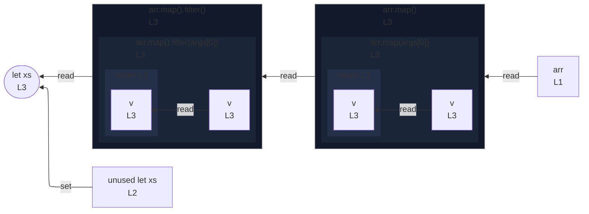

# integration/fixtures/callback/chained-reassigned/input.ts

## Input

```ts
const arr = [1, 2, 3];
let xs = [0];
xs = arr.map((v) => v + 1).filter((v) => v > 0);
```

## Mermaid


```mermaid
%%{init: {"flowchart": {"defaultRenderer": "elk"}}}%%
flowchart RL
  n_scope_0_arr_6["arr<br/>L1"]
  n_scope_0_xs_27["unused let xs<br/>L2"]
  wr_ref_2(["let xs<br/>L3"])
  subgraph call_proxy_42["arr.map().filter()<br/>L3"]
    direction RL
    subgraph s_scope_2["arr.map().filter(args[0])<br/>L3"]
      direction RL
      n_scope_2_v_72["v<br/>L3"]
      subgraph s_return_scope_2_78_83["return L3"]
        direction RL
        ret_use_ref_5["v<br/>L3"]
      end
    end
  end
  subgraph call_proxy_42_63["arr.map()<br/>L3"]
    direction RL
    subgraph s_scope_1["arr.map(args[0])<br/>L3"]
      direction RL
      n_scope_1_v_51["v<br/>L3"]
      subgraph s_return_scope_1_57_62["return L3"]
        direction RL
        ret_use_ref_4["v<br/>L3"]
      end
    end
  end
  call_proxy_42 -->|read| wr_ref_2
  call_proxy_42_63 -->|read| call_proxy_42
  n_scope_0_xs_27 -->|set| wr_ref_2
  n_scope_0_arr_6 -->|read| call_proxy_42_63
  n_scope_1_v_51 -->|read| ret_use_ref_4
  n_scope_2_v_72 -->|read| ret_use_ref_5
  classDef nestL1 fill:#11192a,stroke:transparent;
  class call_proxy_42 nestL1;
  class call_proxy_42_63 nestL1;
  classDef nestL2 fill:#1a2538,stroke:transparent;
  class s_scope_2 nestL2;
  class s_scope_1 nestL2;
  classDef nestL3 fill:#243047,stroke:transparent;
  class s_return_scope_2_78_83 nestL3;
  class s_return_scope_1_57_62 nestL3;
  classDef edgeTargetSubgraph stroke:#888;
  class call_proxy_42 edgeTargetSubgraph;
  class call_proxy_42_63 edgeTargetSubgraph;
```
