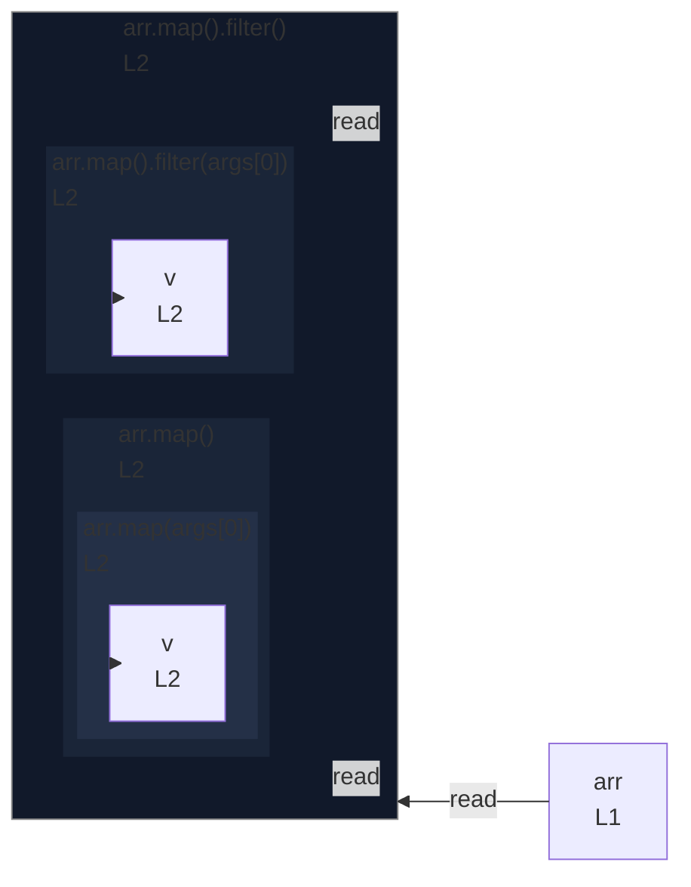

# integration/fixtures/callback/chained-statement/input.ts

## Input

```ts
const arr = [1, 2, 3];
arr.map((v) => v + 1).filter((v) => v > 0);
```

## Mermaid


```mermaid
%%{init: {"flowchart": {"defaultRenderer": "elk"}}}%%
flowchart RL
  n_scope_0_arr_6["arr<br/>L1"]
  subgraph expr_stmt_23["arr.map().filter()<br/>L2"]
    direction RL
    subgraph call_proxy_23_44["arr.map()<br/>L2"]
      direction RL
      subgraph s_scope_1["arr.map(args[0])<br/>L2"]
        direction RL
        n_scope_1_v_32["v<br/>L2"]
      end
    end
    subgraph s_scope_2["arr.map().filter(args[0])<br/>L2"]
      direction RL
      n_scope_2_v_53["v<br/>L2"]
    end
  end
  n_scope_0_arr_6 -->|read| expr_stmt_23
  n_scope_1_v_32 -->|read| expr_stmt_23
  n_scope_2_v_53 -->|read| expr_stmt_23
  classDef nestL1 fill:#11192a,stroke:transparent;
  class expr_stmt_23 nestL1;
  classDef nestL2 fill:#1a2538,stroke:transparent;
  class call_proxy_23_44 nestL2;
  class s_scope_2 nestL2;
  classDef nestL3 fill:#243047,stroke:transparent;
  class s_scope_1 nestL3;
  classDef edgeTargetSubgraph stroke:#888;
  class expr_stmt_23 edgeTargetSubgraph;
```
