# integration/fixtures/callback/in-function-reassigned/input.ts

## Input

```ts
const arr = [1, 2, 3];
function f() {
  let ys = [0];
  ys = arr.map((v) => v + 1);
  return ys;
}
```

## Mermaid

```mermaid
%%{init: {"flowchart": {"defaultRenderer": "elk"}}}%%
flowchart RL
  n_scope_0_arr_6["arr<br/>L1"]
  subgraph wrap_s_scope_1[" "]
    direction TB
    n_scope_0_f_32["unused f()<br/>L2"]
    subgraph s_scope_1["f()<br/>L2-6"]
      direction RL
      n_scope_1_ys_44["let ys<br/>L3"]
      wr_ref_2(["let ys<br/>L4"])
      subgraph call_proxy_61["arr.map()<br/>L4"]
        direction RL
        subgraph s_scope_2["arr.map(args[0])<br/>L4"]
          direction RL
          n_scope_2_v_70["v<br/>L4"]
          subgraph s_return_scope_0_f_32_76_81["return L4"]
            direction RL
            ret_use_ref_4["v<br/>L4"]
          end
        end
      end
      subgraph s_return_scope_0_f_32_86_96["return L5"]
        direction RL
        ret_use_ref_5["ys<br/>L5"]
      end
    end
  end
  call_proxy_61 -->|read| wr_ref_2
  n_scope_1_ys_44 -->|set| wr_ref_2
  n_scope_0_arr_6 -->|read| call_proxy_61
  n_scope_2_v_70 -->|read| ret_use_ref_4
  wr_ref_2 -->|read| ret_use_ref_5
  classDef nestL1 fill:#11192a,stroke:transparent;
  class wrap_s_scope_1 nestL1;
  classDef nestL2 fill:#1a2538,stroke:transparent;
  class s_scope_1 nestL2;
  classDef nestL3 fill:#243047,stroke:transparent;
  class call_proxy_61 nestL3;
  class s_return_scope_0_f_32_86_96 nestL3;
  classDef nestL4 fill:#2d3b57,stroke:transparent;
  class s_scope_2 nestL4;
  classDef nestL5 fill:#364666,stroke:transparent;
  class s_return_scope_0_f_32_76_81 nestL5;
  classDef edgeTargetSubgraph stroke:#888;
  class call_proxy_61 edgeTargetSubgraph;
```


