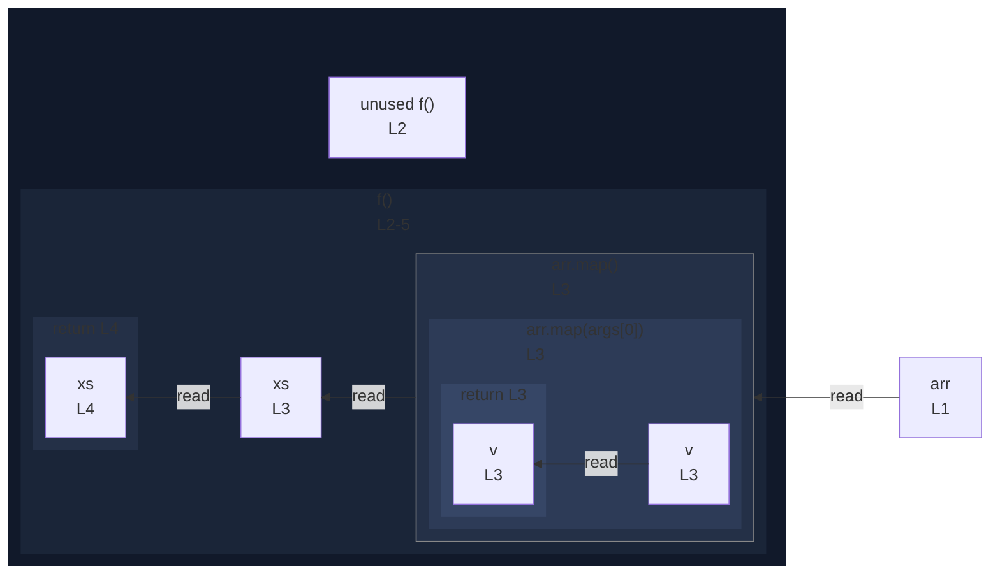

# integration/fixtures/callback/in-function-result-bound/input.ts

## Input

```ts
const arr = [1, 2, 3];
function f() {
  const xs = arr.map((v) => v + 1);
  return xs;
}
```

## Mermaid


```mermaid
%%{init: {"flowchart": {"defaultRenderer": "elk"}}}%%
flowchart RL
  n_scope_0_arr_6["arr<br/>L1"]
  subgraph wrap_s_scope_1[" "]
    direction TB
    n_scope_0_f_32["unused f()<br/>L2"]
    subgraph s_scope_1["f()<br/>L2-5"]
      direction RL
      n_scope_1_xs_46["xs<br/>L3"]
      subgraph call_proxy_51["arr.map()<br/>L3"]
        direction RL
        subgraph s_scope_2["arr.map(args[0])<br/>L3"]
          direction RL
          n_scope_2_v_60["v<br/>L3"]
          subgraph s_return_scope_0_f_32_66_71["return L3"]
            direction RL
            ret_use_ref_3["v<br/>L3"]
          end
        end
      end
      subgraph s_return_scope_0_f_32_76_86["return L4"]
        direction RL
        ret_use_ref_4["xs<br/>L4"]
      end
    end
  end
  call_proxy_51 -->|read| n_scope_1_xs_46
  n_scope_0_arr_6 -->|read| call_proxy_51
  n_scope_2_v_60 -->|read| ret_use_ref_3
  n_scope_1_xs_46 -->|read| ret_use_ref_4
  classDef nestL1 fill:#11192a,stroke:transparent;
  class wrap_s_scope_1 nestL1;
  classDef nestL2 fill:#1a2538,stroke:transparent;
  class s_scope_1 nestL2;
  classDef nestL3 fill:#243047,stroke:transparent;
  class call_proxy_51 nestL3;
  class s_return_scope_0_f_32_76_86 nestL3;
  classDef nestL4 fill:#2d3b57,stroke:transparent;
  class s_scope_2 nestL4;
  classDef nestL5 fill:#364666,stroke:transparent;
  class s_return_scope_0_f_32_66_71 nestL5;
  classDef edgeTargetSubgraph stroke:#888;
  class call_proxy_51 edgeTargetSubgraph;
```
