# integration/fixtures/callback/in-function-statement/input.ts

## Input

```ts
const arr = [1, 2, 3];
function f() {
  arr.forEach((v) => v + 1);
}
```

## Query

```sh
--depth 1
```

## Mermaid

```mermaid
%%{init: {"flowchart": {"defaultRenderer": "elk"}}}%%
flowchart RL
  n_scope_0_arr_6["arr<br/>L1"]
  subgraph wrap_s_scope_1[" "]
    direction TB
    n_scope_0_f_32["unused f()<br/>L2"]
    subgraph s_scope_1["f()<br/>L2-4"]
      direction RL
      beyond_depth_s_scope_1((...))
    end
  end
  n_scope_0_arr_6 -.->|read| beyond_depth_s_scope_1
  classDef boundaryStub stroke:#888,stroke-dasharray:3 3,color:#888;
  class beyond_depth_s_scope_1 boundaryStub;
  classDef nestL1 fill:#11192a,stroke:transparent;
  class wrap_s_scope_1 nestL1;
  classDef nestL2 fill:#1a2538,stroke:transparent;
  class s_scope_1 nestL2;
```


