# integration/fixtures/callback/nested-in-argument/input.ts

## Input

```ts
declare function wrap(xs: number[]): number[];
const items = [1, 2, 3];
const wrapped = wrap(items.map((v) => v + 1));
```

## Mermaid

```mermaid
%%{init: {"flowchart": {"defaultRenderer": "elk"}}}%%
flowchart RL
  n_scope_0_items_53["items<br/>L2"]
  n_scope_0_wrapped_78["unused wrapped<br/>L3"]
  n_scope_0_wrap_88["global wrap"]
  subgraph call_proxy_88["wrap()<br/>L3"]
    direction RL
    subgraph s_scope_1["items.map(args[0])<br/>L3"]
      direction RL
      n_scope_1_v_104["v<br/>L3"]
      subgraph s_return_scope_1_110_115["return L3"]
        direction RL
        ret_use_ref_4["v<br/>L3"]
      end
    end
  end
  call_proxy_88 -->|read| n_scope_0_wrapped_78
  n_scope_0_wrap_88 -->|read,call| call_proxy_88
  n_scope_0_items_53 -->|read| call_proxy_88
  n_scope_1_v_104 -->|read| ret_use_ref_4
  classDef nestL1 fill:#11192a,stroke:transparent;
  class call_proxy_88 nestL1;
  classDef nestL2 fill:#1a2538,stroke:transparent;
  class s_scope_1 nestL2;
  classDef nestL3 fill:#243047,stroke:transparent;
  class s_return_scope_1_110_115 nestL3;
  classDef edgeTargetSubgraph stroke:#888;
  class call_proxy_88 edgeTargetSubgraph;
```


