# integration/fixtures/callback/nested-map/input.ts

## Input

```ts
const matrix = [[1, 2], [3, 4]];
const xs = matrix.map((row) => row.map((c) => c * 2));
```

## Query

```sh
--depth 2
```

## Mermaid

```mermaid
%%{init: {"flowchart": {"defaultRenderer": "elk"}}}%%
flowchart RL
  n_scope_0_matrix_6["matrix<br/>L1"]
  subgraph wrap_call_proxy_44[" "]
    direction TB
    n_scope_0_xs_39["unused xs<br/>L2"]
    subgraph call_proxy_44["matrix.map()<br/>L2"]
      direction RL
      subgraph s_scope_1["matrix.map(args[0])<br/>L2"]
        direction RL
        n_scope_1_row_56["row<br/>L2"]
        subgraph call_proxy_64["row.map()<br/>L2"]
          direction RL
          subgraph s_scope_2["row.map(args[0])<br/>L2"]
            direction RL
            n_scope_2_c_73["c<br/>L2"]
            subgraph s_return_scope_2_79_84["return L2"]
              direction RL
              ret_use_ref_4["c<br/>L2"]
            end
          end
        end
      end
    end
  end
  n_scope_0_matrix_6 -->|read| call_proxy_44
  n_scope_1_row_56 -->|read| call_proxy_64
  n_scope_2_c_73 -->|read| ret_use_ref_4
  classDef nestL1 fill:#11192a,stroke:transparent;
  class wrap_call_proxy_44 nestL1;
  classDef nestL2 fill:#1a2538,stroke:transparent;
  class call_proxy_44 nestL2;
  classDef nestL3 fill:#243047,stroke:transparent;
  class s_scope_1 nestL3;
  classDef nestL4 fill:#2d3b57,stroke:transparent;
  class call_proxy_64 nestL4;
  classDef nestL5 fill:#364666,stroke:transparent;
  class s_scope_2 nestL5;
  classDef nestL6 fill:#3f5175,stroke:transparent;
  class s_return_scope_2_79_84 nestL6;
  classDef edgeTargetSubgraph stroke:#888;
  class call_proxy_44 edgeTargetSubgraph;
  class call_proxy_64 edgeTargetSubgraph;
```


