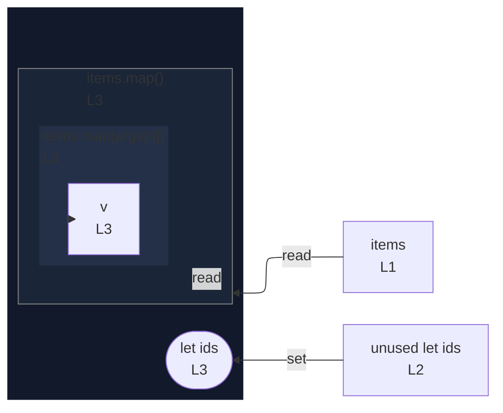

# integration/fixtures/callback/reassigned-method/input.ts

## Input

```ts
const items = [1, 2, 3];
let ids = [0];
ids = items.map((v) => v + 1);
```

## Mermaid


```mermaid
%%{init: {"flowchart": {"defaultRenderer": "elk"}}}%%
flowchart RL
  n_scope_0_items_6["items<br/>L1"]
  n_scope_0_ids_29["unused let ids<br/>L2"]
  subgraph wrap_call_proxy_46[" "]
    direction TB
    wr_ref_2(["let ids<br/>L3"])
    subgraph call_proxy_46["items.map()<br/>L3"]
      direction RL
      subgraph s_scope_1["items.map(args[0])<br/>L3"]
        direction RL
        n_scope_1_v_57["v<br/>L3"]
      end
    end
  end
  n_scope_0_ids_29 -->|set| wr_ref_2
  n_scope_0_items_6 -->|read| call_proxy_46
  n_scope_1_v_57 -->|read| call_proxy_46
  classDef nestL1 fill:#11192a,stroke:transparent;
  class wrap_call_proxy_46 nestL1;
  classDef nestL2 fill:#1a2538,stroke:transparent;
  class call_proxy_46 nestL2;
  classDef nestL3 fill:#243047,stroke:transparent;
  class s_scope_1 nestL3;
  classDef edgeTargetSubgraph stroke:#888;
  class call_proxy_46 edgeTargetSubgraph;
```
