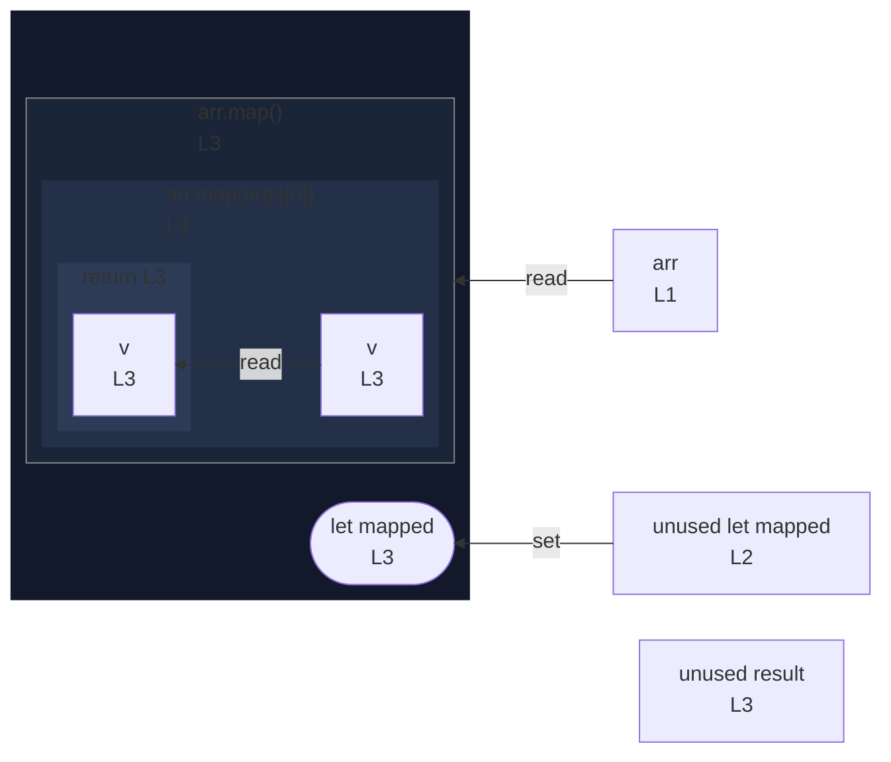

# integration/fixtures/callback/reassigned-nested/input.ts

## Input

```ts
const arr = [1, 2, 3];
let mapped = [0];
const result = (mapped = arr.map((v) => v + 1));
```

## Mermaid


```mermaid
%%{init: {"flowchart": {"defaultRenderer": "elk"}}}%%
flowchart RL
  n_scope_0_arr_6["arr<br/>L1"]
  n_scope_0_mapped_27["unused let mapped<br/>L2"]
  n_scope_0_result_47["unused result<br/>L3"]
  subgraph wrap_call_proxy_66[" "]
    direction TB
    wr_ref_3(["let mapped<br/>L3"])
    subgraph call_proxy_66["arr.map()<br/>L3"]
      direction RL
      subgraph s_scope_1["arr.map(args[0])<br/>L3"]
        direction RL
        n_scope_1_v_75["v<br/>L3"]
        subgraph s_return_scope_1_81_86["return L3"]
          direction RL
          ret_use_ref_5["v<br/>L3"]
        end
      end
    end
  end
  n_scope_0_mapped_27 -->|set| wr_ref_3
  n_scope_0_arr_6 -->|read| call_proxy_66
  n_scope_1_v_75 -->|read| ret_use_ref_5
  classDef nestL1 fill:#11192a,stroke:transparent;
  class wrap_call_proxy_66 nestL1;
  classDef nestL2 fill:#1a2538,stroke:transparent;
  class call_proxy_66 nestL2;
  classDef nestL3 fill:#243047,stroke:transparent;
  class s_scope_1 nestL3;
  classDef nestL4 fill:#2d3b57,stroke:transparent;
  class s_return_scope_1_81_86 nestL4;
  classDef edgeTargetSubgraph stroke:#888;
  class call_proxy_66 edgeTargetSubgraph;
```
