# integration/fixtures/callback/sequential-bindings/input.ts

## Input

```ts
const arr = [1, 2, 3];
const a = arr.map((v) => v * 2);
const b = a.map((v) => v + 1);
const c = b.map((v) => v * 2);
const d = c.map((v) => v + 1);
const e = d.map((v) => v * 2);
```

## Mermaid

```mermaid
%%{init: {"flowchart": {"defaultRenderer": "elk"}}}%%
flowchart RL
  n_scope_0_arr_6["arr<br/>L1"]
  n_scope_0_a_29["a<br/>L2"]
  n_scope_0_b_62["b<br/>L3"]
  n_scope_0_c_93["c<br/>L4"]
  n_scope_0_d_124["d<br/>L5"]
  n_scope_0_e_155["unused e<br/>L6"]
  subgraph call_proxy_33["arr.map()<br/>L2"]
    direction RL
    subgraph s_scope_1["arr.map(args[0])<br/>L2"]
      direction RL
      n_scope_1_v_42["v<br/>L2"]
      subgraph s_return_scope_1_48_53["return L2"]
        direction RL
        ret_use_ref_3["v<br/>L2"]
      end
    end
  end
  subgraph call_proxy_66["a.map()<br/>L3"]
    direction RL
    subgraph s_scope_2["a.map(args[0])<br/>L3"]
      direction RL
      n_scope_2_v_73["v<br/>L3"]
      subgraph s_return_scope_2_79_84["return L3"]
        direction RL
        ret_use_ref_6["v<br/>L3"]
      end
    end
  end
  subgraph call_proxy_97["b.map()<br/>L4"]
    direction RL
    subgraph s_scope_3["b.map(args[0])<br/>L4"]
      direction RL
      n_scope_3_v_104["v<br/>L4"]
      subgraph s_return_scope_3_110_115["return L4"]
        direction RL
        ret_use_ref_9["v<br/>L4"]
      end
    end
  end
  subgraph call_proxy_128["c.map()<br/>L5"]
    direction RL
    subgraph s_scope_4["c.map(args[0])<br/>L5"]
      direction RL
      n_scope_4_v_135["v<br/>L5"]
      subgraph s_return_scope_4_141_146["return L5"]
        direction RL
        ret_use_ref_12["v<br/>L5"]
      end
    end
  end
  subgraph call_proxy_159["d.map()<br/>L6"]
    direction RL
    subgraph s_scope_5["d.map(args[0])<br/>L6"]
      direction RL
      n_scope_5_v_166["v<br/>L6"]
      subgraph s_return_scope_5_172_177["return L6"]
        direction RL
        ret_use_ref_15["v<br/>L6"]
      end
    end
  end
  call_proxy_33 -->|read| n_scope_0_a_29
  call_proxy_66 -->|read| n_scope_0_b_62
  call_proxy_97 -->|read| n_scope_0_c_93
  call_proxy_128 -->|read| n_scope_0_d_124
  call_proxy_159 -->|read| n_scope_0_e_155
  n_scope_0_arr_6 -->|read| call_proxy_33
  n_scope_1_v_42 -->|read| ret_use_ref_3
  n_scope_0_a_29 -->|read| call_proxy_66
  n_scope_2_v_73 -->|read| ret_use_ref_6
  n_scope_0_b_62 -->|read| call_proxy_97
  n_scope_3_v_104 -->|read| ret_use_ref_9
  n_scope_0_c_93 -->|read| call_proxy_128
  n_scope_4_v_135 -->|read| ret_use_ref_12
  n_scope_0_d_124 -->|read| call_proxy_159
  n_scope_5_v_166 -->|read| ret_use_ref_15
  classDef nestL1 fill:#11192a,stroke:transparent;
  class call_proxy_33 nestL1;
  class call_proxy_66 nestL1;
  class call_proxy_97 nestL1;
  class call_proxy_128 nestL1;
  class call_proxy_159 nestL1;
  classDef nestL2 fill:#1a2538,stroke:transparent;
  class s_scope_1 nestL2;
  class s_scope_2 nestL2;
  class s_scope_3 nestL2;
  class s_scope_4 nestL2;
  class s_scope_5 nestL2;
  classDef nestL3 fill:#243047,stroke:transparent;
  class s_return_scope_1_48_53 nestL3;
  class s_return_scope_2_79_84 nestL3;
  class s_return_scope_3_110_115 nestL3;
  class s_return_scope_4_141_146 nestL3;
  class s_return_scope_5_172_177 nestL3;
  classDef edgeTargetSubgraph stroke:#888;
  class call_proxy_33 edgeTargetSubgraph;
  class call_proxy_66 edgeTargetSubgraph;
  class call_proxy_97 edgeTargetSubgraph;
  class call_proxy_128 edgeTargetSubgraph;
  class call_proxy_159 edgeTargetSubgraph;
```


