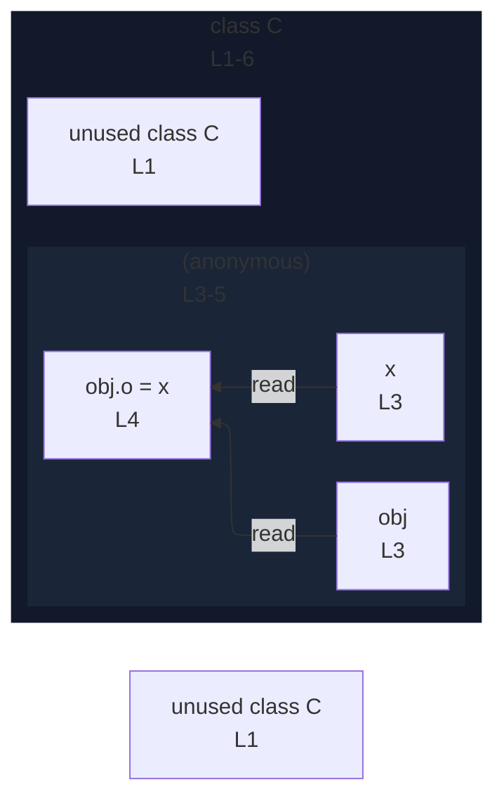

# integration/fixtures/class/declaration/private-field-assignment/input.ts

## Input

```ts
class C {
  #o = 1;
  foo(obj, x) {
    obj.#o = x;
  }
}
```

## Mermaid


```mermaid
%%{init: {"flowchart": {"defaultRenderer": "elk"}}}%%
flowchart RL
  n_scope_0_C_6["unused class C<br/>L1"]
  subgraph s_scope_1["class C<br/>L1-6"]
    direction RL
    n_scope_1_C_6["unused class C<br/>L1"]
    subgraph s_scope_2["(anonymous)<br/>L3-5"]
      direction RL
      n_scope_2_obj_26["obj<br/>L3"]
      n_scope_2_x_31["x<br/>L3"]
      expr_stmt_40["obj.o = x<br/>L4"]
    end
  end
  n_scope_2_obj_26 -->|read| expr_stmt_40
  n_scope_2_x_31 -->|read| expr_stmt_40
  classDef nestL1 fill:#11192a,stroke:transparent;
  class s_scope_1 nestL1;
  classDef nestL2 fill:#1a2538,stroke:transparent;
  class s_scope_2 nestL2;
```
